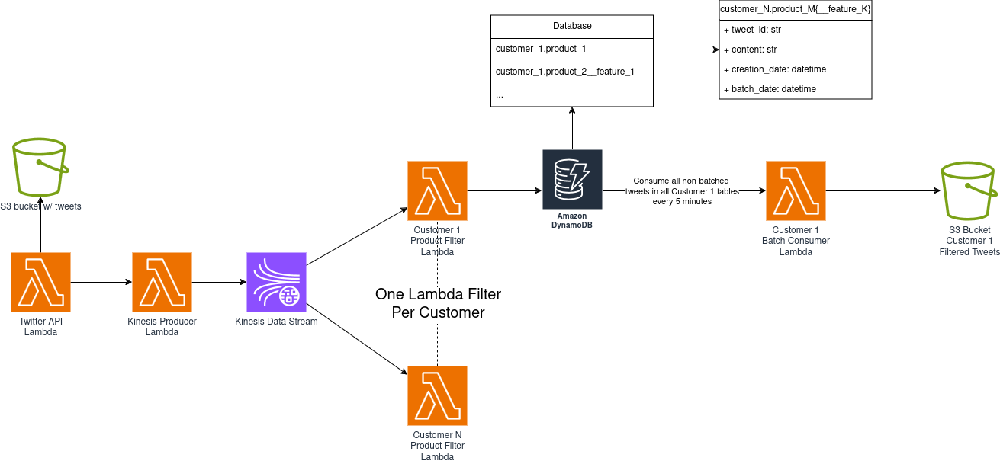

# sentiment-analysis-system


## Twitter Fake API
Dataset: https://www.kaggle.com/datasets/kazanova/sentiment140

## S3 buckets structure

raw data bucket
```
    bucket_customer1:
        - product_1/
            - raw/
                - raw_tweet_batch_1.json
                ...
                - raw_tweet_batch_N.json
            - processed/
                - processed_results_1.parquet
                ...
                - processed_results_N.parquet
        ...
        - product_M.feature_K
            ...
```

predicted data bucket
```
    bucket/
        - customer_1
            - predictions_1
            ...
            - predictions_N
        ...
        - customer_M
            ...
```

## Model

Requirements: 
- Have an instance with at least 8GB of memory
- Have python installed
- requirements.txt installed


## Data ingestion pipeline

